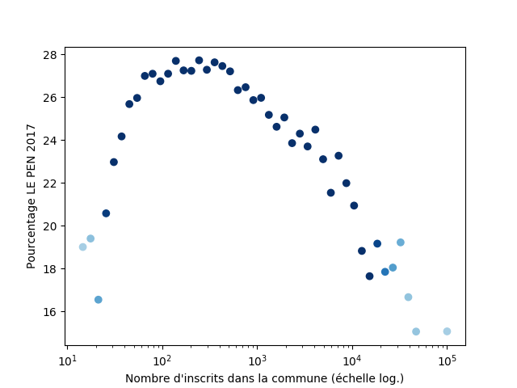
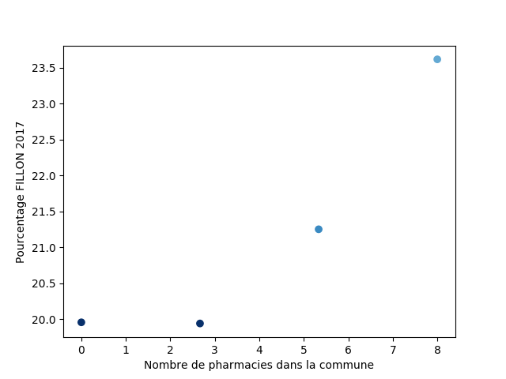
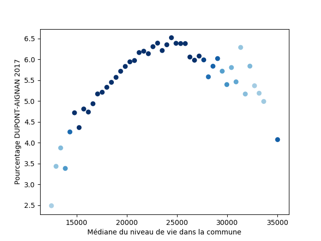
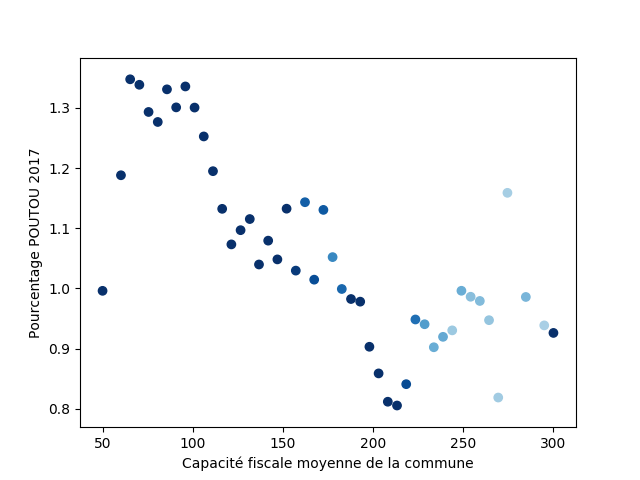

# Présidentielle 2017 : En fonction de...

Ces scripts sont livrés comme tels, sans AUCUNE GARANTIE.

Il existe de nombreux biais dans le code.
Il faut prendre en compte que le nombre de villes d'une certaine taille peut varier très fortement, rendant l'erreur statistique importante pour certains points des courbes.
Par ailleurs toutes les villes > 100 000 habitants sont regroupées, il est intéressant de les séparer pour remarquer des disparités (Nice, Marseille).

L'échelle par défaut est logarithmique.

Le script a été majoritairement fait pour le fun pour mettre en vis-à-vis des valeurs pas directement liées.

## Exemples

```python
candidat = "MACRON"
en_fonction_de = "INSCRITS"
abscisse = "Nombre d'inscrits dans la commune (échelle log.)"
x_start = 10
x_end = 100000
x_scale_log = True
precision = 50
min_occ = 15
```


---

```python
candidat = "LE PEN"
en_fonction_de = "INSCRITS"
abscisse = "Nombre d'inscrits dans la commune (échelle log.)"
x_start = 10
x_end = 100000
x_scale_log = True
precision = 50
min_occ = 15
```


---

```python
candidat = "FILLON"
en_fonction_de = "PHARMACIES"
abscisse = "Nombre de pharmacies dans la commune"
x_start = 0
x_end = 8
x_scale_log = False
precision = 4
min_occ = 15
```


---

```python
candidat = "MÉLENCHON"
en_fonction_de = "PROPRIETAIRES"
abscisse = "Pourcentage de propriétaires dans la commune"
x_start = 10
x_end = 50
x_scale_log = False
precision = 30
min_occ = 15
```


---

```python
candidat = "DUPONT-AIGNAN"
en_fonction_de = "MEDIANE"
abscisse = "Médiane du niveau de vie dans la commune"
x_start = 12500
x_end = 35000
x_scale_log = False
precision = 50
min_occ = 15
```


---

```python
candidat = "POUTOU"
en_fonction_de = "CAPACITE_FISCALE"
abscisse = "Capacité fiscale moyenne de la commune"
x_start = 50
x_end = 300
x_scale_log = False
precision = 50
min_occ = 15
```


## Système requis

Le script est écrit en Python 3.

Les modules utilisés :

* matplotlib 1.5.1
* numpy 1.11.0
* (scipy) 0.17.0

Sous Debian :
```
sudo apt-get install python3 python3-numpy python3-matplotlib python3-scipy
```

## TODO

* Mettre le nombre d'occurrences pour la fiabilité des résultats.
* Calculer le pourcentage en fonction du nombre d'inscrits plutôt que d'occurrences
	* Sur l'échelle logarithmique ? (pour la fonction `find_nearest_idx`)
* Gérer plusieurs candidats sur un même graphique
* Rajouter des corrélations possibles
* Interpoler les courbes

## Références

Les références techniques sont au sein du code.

Jeux de données utilisés :

* [Résultats élections présidentielle 2017](https://www.data.gouv.fr/fr/datasets/election-presidentielle-des-23-avril-et-7-mai-2017-resultats-du-1er-tour-1/) : nombre d'inscrits, pourcentage de vote par candidats, etc. - INSEE, 2017
* [Data INSEE sur les communes](http://www.data.gouv.fr/fr/datasets/data-insee-sur-les-communes/) : nombre de dentistes, de propriétaires, etc. - INSEE, 2014
	* (Semble contenir des erreurs, et dater d'avant 2014)
* [Revenus et pauvreté des ménages en 2013](https://www.insee.fr/fr/statistiques/2388572) : Médiane des salaires, taux de pauvreté, etc. - INSEE, 2013
